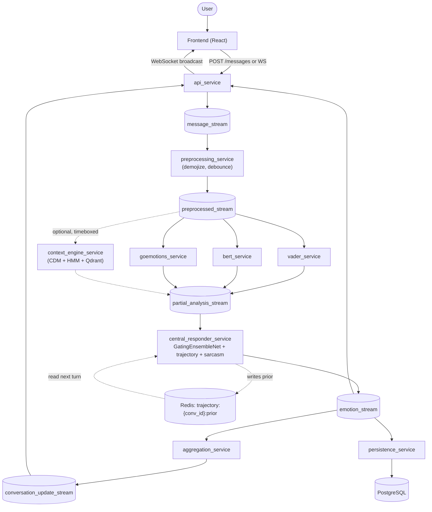

# InnerLink - Real-Time Emotion Analysis Chat System

InnerLink is a chat app that analyzes the emotion in every message as it is sent. Text passes through several NLP models running in parallel. A meta-learner combines their outputs into one prediction. A trajectory model predicts where the conversation is heading emotionally. The frontend shows the result next to each message, with an emotion color, a label, and a confidence score.

This README links to the code behind each algorithm, formula, and design choice below, instead of re-explaining it in prose. Each link points to a line in the current `main` branch. If a file has moved, the function or class name is also given, so it can still be found.

---

## Architecture

| Service | Port | Purpose |
|---|---|---|
| [`ingestion_service`](ingestion_service) | 8000 | REST entry point. Accepts messages and publishes them to Redis `message_stream`. |
| [`preprocessing_service`](preprocessing_service) | - | Normalizes text (debounced), converts emoji to words, publishes to `preprocessed_stream`. |
| [`vader_service`](vader_service) | - | Lexicon sentiment, 4 scores. |
| [`bert_service`](bert_service) | - | 7-class Ekman emotion, dual-model ensemble. |
| [`goemotions_service`](goemotions_service) | - | 28-class GoEmotions, 3-model blend, plus a VAD lexicon lookup. |
| [`central_responder_service`](central_responder_service) | - | Fuses all model outputs with the meta-learner. Also runs the trajectory and sarcasm models. |
| [`trainer_service`](central_responder_service/trainer) | - | Retrains the meta-learner in the background. Hot-reloads it through Redis pub/sub. |
| [`context_engine_service`](context_engine_service) | - | Conversation Dynamics Machine (CDM), plus episodic memory in Qdrant. |
| [`aggregation_service`](aggregation_service) | - | Tracks conversation state, mood, valence trajectory, and emotional dynamics. |
| [`llm_reasoning_service`](llm_reasoning_service) | - | Optional LLM reasoning layer. Rule-based by default. |
| [`persistence_service`](persistence_service) | - | Batches writes to PostgreSQL. Has a dead-letter queue for failed events. |
| [`api_service`](api_service) | 8001 | REST and WebSocket API for the frontend. Handles JWT auth. |
| [`frontend_service`](frontend_service) | 5173 | React app, served by Nginx. |
| `qdrant` | 6333 | Vector DB. Episodic memory for the context engine. |
| `redis` | 6379 | Message bus (Streams) and live state (Hashes). |
| `db` (PostgreSQL) | 5432 | Long-term storage. |

Defined in [`docker-compose.yml`](docker-compose.yml), 16 services in total.

### Message flow



The context engine is the only optional stage. The responder waits up to `OPTIONAL_TIMEOUT_MS` for it, then continues with a zero context vector if it has not answered. See [`shared/module_registry.py`](shared/module_registry.py#L12) (`ModuleRegistry`). Required models are `go_emotions`, `basic_bert`, and `vader`. The optional one is `context_engine`.

---

## Core ML Pipeline

### Parallel analyzers

| Analyzer | Code | Role |
|---|---|---|
| VADER | [`vader_service/main.py#L18`](vader_service/main.py#L18) | Lexicon-based sentiment, `neg`, `neu`, `pos`, `compound`. Cheap and fast. Reads raw text, so it scores emoji directly. |
| BERT-Ekman | [`bert_service/main.py#L35`](bert_service/main.py#L35) | `j-hartmann/emotion-english-distilroberta-base`, blended 0.70/0.30 with a second `bhadresh-savani` model, for the 7 Ekman classes. |
| GoEmotions blend | [`goemotions_service/main.py#L108`](goemotions_service/main.py#L108) | `0.55 * primary + 0.25 * secondary + 0.20 * semantic`. Combines a fine-tuned SamLowe RoBERTa model, a second BERT checkpoint, and a MiniLM cosine match against 28 prototype sentences ([`_semantic_scores`](goemotions_service/main.py#L89)). |
| VAD lexicon | [`goemotions_service/vad_lexicon.py#L247`](goemotions_service/vad_lexicon.py#L247) | `compute_vad()`. Averages Warriner (2013) style valence, arousal, and dominance scores over the recognized words in a message. |

### The 116-dimension feature vector

Every message is turned into one 116-number vector before the meta-learner sees it. [`build_feature_vector`](central_responder_service/meta_learner.py#L262) builds it at inference time, and [`trainer/cycle.py`](central_responder_service/trainer/cycle.py#L40) builds it the same way for training. If the two ever produce different shapes, the classifier throws a feature-count error. The dimension constants live in [`shared/constants.py#L46`](shared/constants.py#L46).

| Block | Indices | Size | Source |
|---|---|---|---|
| VADER | `[0:4]` | 4 | 4 lexicon scores |
| BERT Ekman | `[4:11]` | 7 | 7 Ekman labels |
| GoEmotions | `[11:39]` | 28 | 28-class distribution |
| VAD lexicon | `[39:42]` | 3 | valence, arousal, dominance |
| CDM context | `[42:82]` | 40 | context engine's state machine, HMM, and scalars |
| Trajectory prior | `[82:110]` | 28 | last turn's predicted next-message distribution |
| Sarcasm | `[110]` | 1 | sarcasm classifier score, `[0,1]` |
| Dynamics | `[111:113]` | 2 | emotional inertia and contagion |
| Appraisal | `[113:116]` | 3 | novelty, goal congruence, coping (Scherer, 2001) |

All nine blocks are joined together in one line, [`meta_learner.py#L318`](central_responder_service/meta_learner.py#L318). The CDM block also passes through a leak-mask (`_CDM_KEEP`) at [`meta_learner.py#L296`](central_responder_service/meta_learner.py#L296). This mask was added after a label-leakage bug, described in [Results and Known Limitations](#results-and-known-limitations).

### Meta-learner, `GatingEnsembleNet`

[`meta_learner.py#L135`](central_responder_service/meta_learner.py#L135) is a PyTorch mixture-of-experts network. Separate encoders process the VADER, BERT, GoEmotions, and VAD blocks, plus the 74-dimension context block. A learned softmax gate, in `forward()` at [`#L163`](central_responder_service/meta_learner.py#L163), decides how much weight each expert gets per message. A sigmoid-gated blend then mixes that NLP-expert prediction with a context-only prior, based on how confident the context engine's HMM is (`ctx_weight`, driven by `hmm_conf`).

There is one hard rule in the network. GoEmotions can never claim more than 50% of the gate, no matter what the training data suggests. See [`goe_capped = ctx_gate_raw[:, 2:3].clamp(max=0.50)`](central_responder_service/meta_learner.py#L180). This exists because GoEmotions is the most detailed signal. Left unconstrained, it tends to dominate the ensemble and drown out VADER, BERT, and VAD.

Inference entry point, [`predict_with_meta_learner`](central_responder_service/meta_learner.py#L330). If no trained model is loaded, it falls back to a GoEmotions to BERT to VADER argmax chain, so the pipeline never fails just because a model file is missing.

Explainability and guardrails:
- [`calculate_feature_impacts`](central_responder_service/meta_learner.py#L537). Leave-one-block-out ablation, zero the VADER, BERT, GoEmotions, or Context block in turn, and measure the drop in the predicted class's probability. This explains why a label was chosen.
- [`detect_emotional_conflicts`](central_responder_service/meta_learner.py#L513). A heuristic pattern matcher for cognitive dissonance, sarcasm, passive-aggression, and hyperbole. For example, high VADER positivity combined with a strong negative GoEmotions signal.
- [`implicit_emotion.py`](central_responder_service/implicit_emotion.py): [`is_implicit_candidate`](central_responder_service/implicit_emotion.py#L20) and [`should_override`](central_responder_service/implicit_emotion.py#L37) route understated or indirect messages, ones with low confidence or an ambiguous neutral label, to a secondary check. Veto rules stop it from overriding a strong lexical signal.
- [`apply_context_correction`](central_responder_service/meta_learner.py#L556). Currently a documented no-op, it returns the scores unchanged. It is wired into the pipeline as an extension point, not active logic today.

### Context engine, Conversation Dynamics Machine (CDM)

[`context_engine_service/cdm.py`](context_engine_service/cdm.py) implements a 15-state finite state machine, [`IntentStateMachine`](context_engine_service/cdm.py#L143). States are `NEUTRAL, WARMTH, PRAISE, HELP_REQUEST, HUMOR, TENSION, CONFLICT, ARGUMENT, WITHDRAWAL, RECONCILIATION, CURIOSITY, ASSERTIVENESS, EMPATHY, FRUSTRATION, AGREEMENT`. It sits on top of a hidden Markov model. Each turn, [`transition()`](context_engine_service/cdm.py#L144) runs one HMM forward step, `alpha_t = (alpha_prev @ transmat) * emissionprob[:, obs]`. It reports the resulting state confidence, entropy ([`#L174`](context_engine_service/cdm.py#L174)), and top-3 next-state probabilities back into the feature vector.

Also computed each turn, in [`context_engine_service/main.py`](context_engine_service/main.py):
- Velocity and acceleration ([`#L278-279`](context_engine_service/main.py#L278)). The first and second difference of the speaker's own valence sequence, showing how fast, and how abruptly, their mood is moving.
- Episodic memory. [`calculate_user_baseline`](context_engine_service/main.py#L132) queries Qdrant for a user's 5 nearest past messages, and aggregates their valence into `historical_pos`, `historical_neu`, and `historical_neg`. This tells the meta-learner whether the current message is normal for this person.
- Appraisal ([`context_engine_service/appraisal.py#L4`](context_engine_service/appraisal.py#L4)). A simplified Scherer (2001) appraisal model. `novelty` comes from how abruptly the context changed, `goal_congruence` from valence times topic resonance, and `coping` from `(1 - volatility)` and `(1 - speaker_divergence)`.

The whole service is optional and degrades gracefully, as shown in [Message flow](#message-flow). If it stops, the rest of the pipeline keeps running.

### Trajectory, `EmotionalDialogueEncoder` (EDE)

[`central_responder_service/trajectory/model.py#L12`](central_responder_service/trajectory/model.py#L12). Some project docs still call this a trajectory LSTM, but it is actually a 2-layer, 4-head Transformer encoder with a learned CLS token. [`forward()`](central_responder_service/trajectory/model.py#L66) takes the last 12 real GoEmotions distributions in the conversation, shaped `[B, 12, 28]`. The pooled CLS output feeds two heads, a 28-way softmax prior for what emotion comes next, and a 6-way conversation-phase classifier (`opening, escalation, peak, turning_point, resolution, sustained`).

[`run_trajectory_step`](central_responder_service/trajectory/inference.py#L93) runs after every message. It writes the prior to Redis, at [`trajectory:{conv_id}:prior`](central_responder_service/trajectory/inference.py#L146). `aggregate_and_publish` reads that value back on the next message, and feeds it into feature slot `[82:110]`. So each message's prediction is shaped by what the model expected before that message was written. This step is optional. If the model files are missing, it falls back to a zero prior.

### Sarcasm detection

[`sarcasm_classifier.py`](central_responder_service/sarcasm_classifier.py) is a fine-tuned DistilBERT head ([`_SarcasmNet`](central_responder_service/sarcasm_classifier.py#L23), DistilBERT, dropout, then a linear layer over the `[CLS]` token). It is trained on tweet_eval irony data, plus a sincere, hard-positive, minimal-pair augmentation set. [`predict()`](central_responder_service/sarcasm_classifier.py#L56) returns a raw `[0,1]` sigmoid score, loaded through [`load_sarcasm_model`](central_responder_service/sarcasm_classifier.py#L74). The decision threshold comes from `sarcasm_clf_config.json` and is re-tuned every training run, rather than fixed in code. See the measured F1 and AUC in [Results and Known Limitations](#results-and-known-limitations).

### Dynamics, inertia and contagion

[`aggregation_service/emotion_dynamics.py`](aggregation_service/emotion_dynamics.py). [`compute_inertia`](aggregation_service/emotion_dynamics.py#L17) is the lag-1 autocorrelation of a speaker's own valence over their last 12 turns, a measure of how emotionally "sticky" they are. [`compute_contagion`](aggregation_service/emotion_dynamics.py#L25) is the lagged cross-correlation between one speaker's valence and the other's, a measure of how much one person's mood spreads to the other. Both are grounded in Kuppens' and Kramer's affect-dynamics research.

---

## Retraining pipeline

[`trainer/cycle.py`](central_responder_service/trainer/cycle.py): [`run_one_cycle`](central_responder_service/trainer/cycle.py#L40) loads PostgreSQL message history plus cached open datasets (GoEmotions, EmpatheticDialogues, MELD, DailyDialog) from `.cache/`. It extracts features through the same `build_feature_vector` code path, using per-dataset extractors. It trains a fresh `GatingEnsembleNet`, and only deploys it if test accuracy clears `ACCURACY_GATE` (default `0.40`). Otherwise the currently loaded model keeps serving. It runs either as the standalone `trainer_service` container (`TRAINER_EXTERNAL=true` by default), or as an in-process background thread.

[`trainer/finetune_goe.py#L58`](central_responder_service/trainer/finetune_goe.py#L58) is a separate, standalone script. It fine-tunes the upstream GoEmotions RoBERTa checkpoint itself, using class-weighted cross-entropy. It improves the GoEmotions expert, not the meta-learner.

---

## API, auth, and real-time delivery

- JWT auth, [`api_service/auth_utils.py`](api_service/auth_utils.py). [`create_jwt`](api_service/auth_utils.py#L27) and [`decode_jwt`](api_service/auth_utils.py#L38), HS256, with bcrypt-hashed passwords. The username matching `ADMIN_USERNAME` gets the admin role on registration.
- WebSocket fan-out. [`websocket_endpoint`](api_service/main.py#L379) authenticates the connection and registers it. A background task, [`redis_listener`](api_service/main.py#L343), tails `conversation_update_stream`, `reasoning_update_stream`, and `partial_result_stream`, and relays events through [`ConnectionManager.broadcast_to_user`](api_service/websocket/manager.py#L29) to every participant, not just the sender.
- Conversation insights. [`GET /conversation/{id}/emotional-state`](api_service/routes/conversations.py#L295) reads the live Redis snapshot, mood, dominant emotion, trajectory, and a 5-entry mood arc. [`POST /conversation/{id}/analyze`](api_service/routes/conversations.py#L504) recomputes it from the full PostgreSQL history. It groups consecutive messages by mood, and compares the first and last valence to produce an `escalating`, `de-escalating`, or `stable` verdict.

---

## Frontend

React, built with Vite, served by Nginx. [`main.jsx`](frontend_service/src/main.jsx#L5) fixes the CSS load order, `tailwind.css`, then `design-system.css`, then `emotionBubbles.css`, then `index-v2.css`. `App.jsx` adds `CrystalGlass-v2.css` on top. [`pages/IGDashboard.jsx`](frontend_service/src/pages/IGDashboard.jsx) is the main chat view, styled like Instagram. Message bubbles are colored by dominant emotion, updates arrive live over WebSocket, and an admin Pipeline Inspector shows the raw per-model scores, gate weights, and sarcasm score behind any message.

---

## Results and Known Limitations

Measured against the live pipeline with `qa_suite/`, 3,269 automated tests, last calibrated 2026-07-21. The numbers below are reported as measured, including the less flattering ones. A label-leakage bug once made the meta-learner look far more accurate than it really was. Once the team found it, they chose to report the honest, lower number instead.

| Metric | Result |
|---|---|
| Single-message analysis latency (warm) | 0.24-0.36 s |
| Sustained throughput | About 3-4 messages/s, with no latency growth under load |
| Robustness (3,000 fuzzed, typo, leetspeak, and emoji-spam inputs) | 3,000 out of 3,000, no crash |
| 28-emotion coverage corpus (224 messages) | 93.8% family accuracy. Weakest family (anger/surprise) was 87.5%. |
| Real GoEmotions vs. human gold labels (2,000 messages) | 71.5% family accuracy, 61.3% exact top-1 |
| Hand-authored hard edge-case corpus (109 messages) | 68.8% |
| Tagged conversations, in context (12 conversations, 53 turns) | 75.5% |
| Generated conversations, in context (3,000 conversations, 13,250 turns) | 96.1% |
| Valence-arc trend match (3,000 generated conversations) | 84.5% |
| Conversation-insights latency (`analyze` to `emotional-state`) | 0.01 s, on a short conversation |
| Meta-learner test accuracy (honest, after the label-leak fix) | 0.3378 (macro-F1 0.3326) |
| Sarcasm classifier | val F1 0.742, AUC 0.789 |

Known limitations, documented rather than hidden:
- Two separate label-leakage bugs were found and fixed during development. A GoEmotions self-leak, where fixing it dropped accuracy from 0.7003 to 0.6644. And a CDM context-block leak, which had inflated the meta-learner's reported accuracy to 0.6479. The corrected, honest number is 0.3378. 28-class emotion classification on real conversational text is genuinely hard, and this repo reports the real number instead of the leaked one.
- `relief` (F1=0.118, 23 training examples) and `grief` (F1=0.310, 139 examples) remain structurally weak. This is a data-volume problem, not a bug.
- The sarcasm classifier still over-fires on sincere gratitude, for example a raw score of about 0.94 on a genuine "thank you" message. This is mitigated in production, by capping and zeroing the feature slot downstream, but not fixed at the source.
- Zero `is_verified` rows exist in PostgreSQL. Every model is trained on public datasets and synthetic data, never on confirmed-correct live labels.
- The context engine's influence on the gate, `CTX_WEIGHT_CAP`, is deliberately kept low, pending a verified-label pipeline to validate it against.
- No WebSocket reconnect with back-off, no BERT request batching, and no mobile support yet.

---

## Getting Started

```bash
# Start everything (builds all 16 services)
docker compose up --build -d
# or, with extra environment and health-check orchestration:
./start.sh

# Rebuild a single service after code changes
docker compose up --build <service_name> -d

# Watch logs for a service
docker logs -f projects-final-central_responder_service-1

# QA suite (offline = no running stack needed)
./qa_suite/run_qa.sh offline

# Repo unit tests
python -m pytest
```

Key `.env` variables, see [`docs/CLAUDE.md`](docs/CLAUDE.md#environment-env) for the full list: `INTERNAL_API_KEY`, `JWT_SECRET`, `REDIS_PASSWORD`, `RETRAIN_INTERVAL_SECONDS`, `ACCURACY_GATE`, `TRAINER_EXTERNAL`, `LLM_PROVIDER`, `ADMIN_USERNAME`, `OPTIONAL_TIMEOUT_MS`.

---

## Repo layout

```
ingestion_service/          REST entry point
preprocessing_service/      text normalization + demojizing
vader_service/               lexicon sentiment
bert_service/                7-class Ekman emotion
goemotions_service/          28-class GoEmotions + VAD lexicon
context_engine_service/      CDM state machine + HMM + Qdrant episodic memory
central_responder_service/   meta-learner fusion, trajectory, sarcasm, trainer/
aggregation_service/         conversation state, mood/valence dynamics
llm_reasoning_service/       optional LLM reasoning layer
persistence_service/         PostgreSQL writes + DLQ
api_service/                 REST + WebSocket API, auth
frontend_service/            React app
shared/                      cross-service constants, module registry, logging
qa_suite/                    functional + non-functional test suite
conversation_state_learner/  offline trajectory/sarcasm training + data collection
docs/                        architecture notes, development journal, capstone report
```
